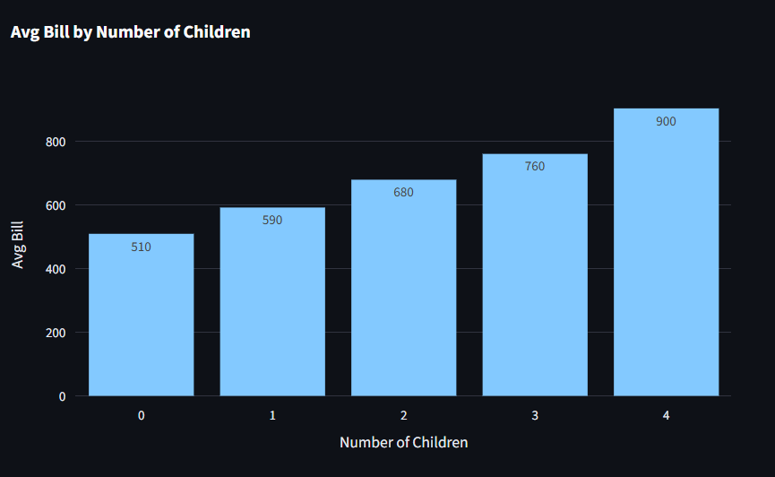
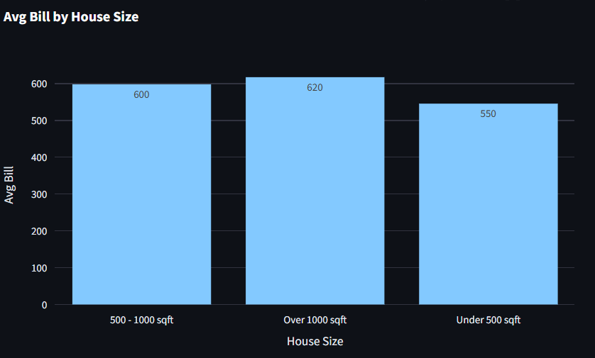

# ⚡ Electricity Bill ETL Pipeline & Dashboard

A mini data engineering project that builds a complete ETL pipeline to extract, clean, store, and analyze household electricity bill data.  
It also includes an interactive dashboard built with Streamlit to visualize key insights.

---

## 🚀 Project Overview

- **Goal:** Analyze how different household characteristics (e.g., size, number of people, location) influence electricity bills.
- **Pipeline Type:** Mini ETL Pipeline (Extract → Transform → Load)
- **Tech Stack:**
  - Python (pandas, pyodbc, sqlalchemy)
  - Microsoft SQL Server
  - Streamlit + Plotly
- **Key Skills Applied:**
  - Data extraction & transformation
  - Data modeling & SQL querying
  - Interactive dashboard development

---

## 🛠️ Pipeline Steps

| Step       | Description |
|------------|-------------|
| 🔄 Extract | Load mock data from a CSV file (simulating API input) |
| 🧹 Transform | Handle missing values, convert units, validate data |
| 💾 Load     | Insert cleaned data into SQL Server |
| 📊 Analyze  | Run SQL queries to understand usage behavior |
| 📈 Visualize| Streamlit dashboard with 4 key charts |

---

## 🗂️ Folder Structure

```
ELECTRICITY_ETL_PROJECT/
├── data/                  # Raw data (CSV)
├── etl/                   # extract.py, transform.py, load.py
├── utils/                 # db_connection.py
├── screenshots/           # dashboard images
├── sql/                   # schema.sql, analysis_queries.sql
├── dashboard/             # dashboard.py (Streamlit app)
├── main.py                # ETL runner
├── dashboard_analysis.md  # Written insights from charts
├── requirements.txt
└── README.md
```

---

## 📊 Dashboard Preview

### 1. Avg Electricity Bill by Number of Children



> Electricity bills tend to increase as the number of children in a household grows, possibly due to longer lighting time, entertainment needs, and energy usage for child-related appliances.

---

### 2. Avg Bill by House Size



> Households with larger living areas generally pay higher bills, likely due to higher cooling and lighting needs.

---

## ✅ How to Run

### 1. Clone the project

```bash
git clone https://github.com/Akari2512/mini_data_pipeline.git
cd mini_data_pipeline
```

### 2. Set up environment

```bash
pip install -r requirements.txt
```

### 3. Run the ETL Pipeline

```bash
python main.py
```

### 4. Start the Dashboard

```bash
streamlit run dashboard/dashboard.py
```

---

## 📄 Dashboard Analysis

See full insights in [`dashboard_analysis.md`](dashboard_analysis.md)

---

## 👨‍💻 Author

**Ngo Nguyen Duc Quang**  
Data Engineer Fresher  
📧 Email: `ngonguyenducquang@gmail.com`

---

## ⭐ Bonus – What This Project Demonstrates

- ✅ Ability to build an end-to-end data pipeline  
- ✅ Clean, validated data handling  
- ✅ Ability to create actionable visual insights  
- ✅ Familiarity with SQL, Python, Streamlit – key DE tools
